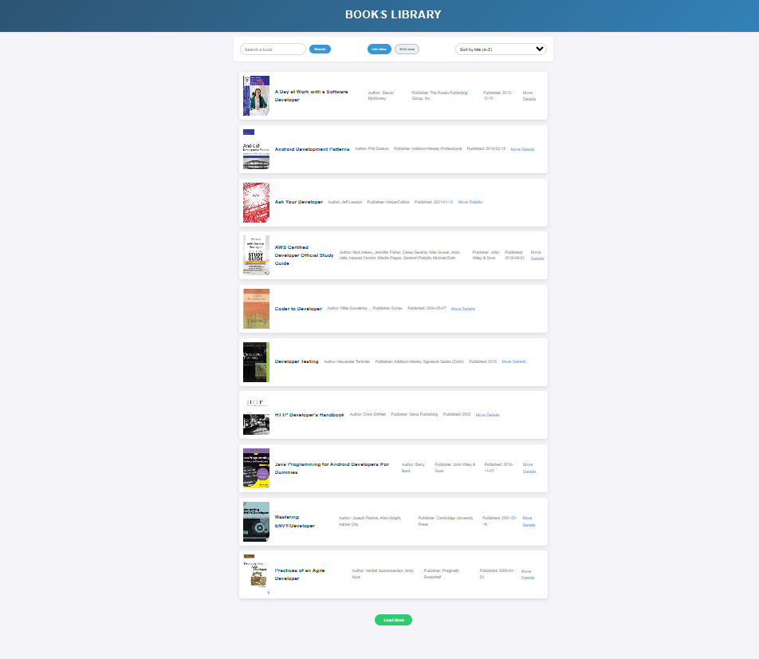

# Books Library

## Summary

Books Library is a dynamic web application that fetches and displays book data from the [FreeAPI.app](https://freeapi.app) API. It provides a user-friendly interface for browsing and discovering books, featuring:

- **Search** by title or author  
- **Sort** by title or publication date  
- **Toggle** between grid and list views  
- **Pagination** to load more books  
- **Detailed book links** opening in a new tab  

Built with **HTML**, **CSS**, and **JavaScript**, this project highlights responsive design and interactive data handling, making it easy for users to explore and find their next read.

## Features

- **Dynamic Book Fetching**: Retrieves book data from the FreeAPI.app API.
- **Search Functionality**: Filter books by title or author in real-time.
- **Sorting Options**: Sort books by title (A-Z or Z-A) or publication date (newest or oldest first).
- **View Toggle**: Switch between grid and list layouts.
- **Pagination**: Load additional books with a "Load More" button.
- **External Links**: Click "More Details" to open book information in a new tab.

## Tech Stack

- **HTML**: Structure of the web page.
- **CSS**: Styling and responsive design.
- **JavaScript**: API requests, event handling, and dynamic content rendering.

## Usage

- **Search**: Enter a keyword in the search bar and press Enter or click "Search" to filter books.
- **Sort**: Select an option from the dropdown to sort books (e.g., "Sort by title (A-Z)").
- **Toggle View**: Click "List view" or "Grid view" to change the layout.
- **Load More**: Click "Load More" to fetch additional books.
- **View Details**: Click "More Details" on a book to open its full info in a new tab.

## API

- **Endpoint**: `GET https://api.freeapi.app/api/v1/public/books`
- **Parameters**: 
  - `page` (pagination)
  - `limit` (books per page)
- **Documentation**: [FreeAPI.app API Guide](https://freeapi.hashnode.space/api-guide/apireference/getBooks)

## Screenshots

### Home Page (Grid View)

### Search Functionality

### Sorting Options

### List View

